<p align="center">
  
</p>
<h1 align="center">BirdnetPi++</h1>
<p align="center"><i>The long-term monitoring edition of BirdNET-Pi</i></p>
<p align="center"><b>Turn a Raspberry Pi into a 24/7 bird observatory that listens, identifies, records and tells you what matters.</b></p>
<p align="center">
  <a href="https://github.com/EvaldoOliveira/BirdnetPiPlusPlus/releases"></a>
  
  
  <a href="LICENSE"></a>
</p>
<p align="center">
  <a href="#how-to-get-birdnetpi"><b>Installation guide</b></a> ·
  <a href="#features"><b>Features</b></a> ·
  <a href="#screenshots"><b>Screenshots</b></a> ·
  <a href="https://github.com/EvaldoOliveira/BirdnetPiPlusPlus/releases"><b>Releases</b></a> ·
  <a href="#reporting-issues"><b>Help</b></a>
</p>
<p align="center">
  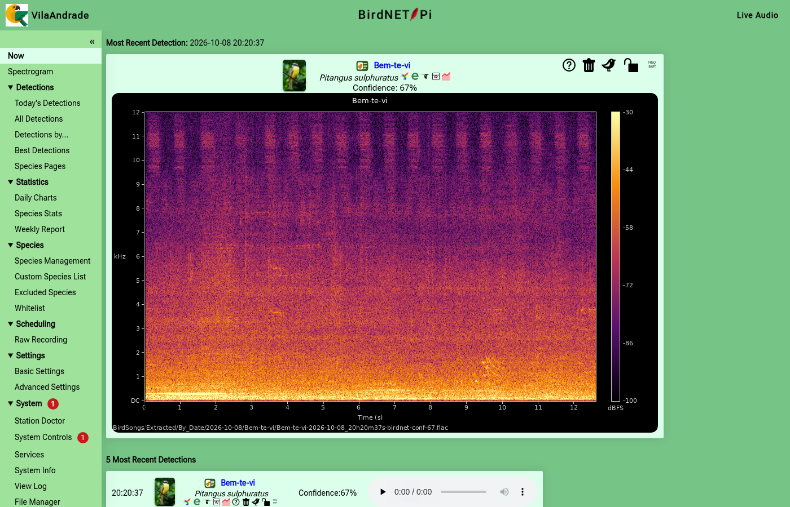
  <br><sub><i>The Now page of the pilot station in São Paulo — BirdNET+ V3 with Brazilian (CBRO) names.</i></sub>
</p>
<p align="center"><sub>⚠️ <a href="LICENSE">Review the licence</a> — BirdnetPi++, like BirdNET-Pi, may not be used to develop a commercial product.</sub></p>

## More than bird identification

**BirdnetPi++** is an independent edition of BirdNET-Pi, maintained as a hard fork of
[Nachtzuster/BirdNET-Pi](https://github.com/Nachtzuster/BirdNET-Pi) — itself the maintained continuation of
[mcguirepr89/BirdNET-Pi](https://github.com/mcguirepr89/BirdNET-Pi) — from upstream commit `88985a3` (v0.11 line,
forked on 2026-08-29).

BirdnetPi++ keeps everything BirdNET-Pi does — continuous recording, real-time identification, clip extraction, charts,
live audio — and adds what a station needs to run for years: the newest model, trustworthy data, notifications
that only interrupt you for what matters, and a station that tells you when something is wrong.

### Features

<table>
<tr>
<td width="33%" valign="top">

#### 🧠 V3 model and shadow models
**BirdNET+ V3** (about 10,000 classes) with its own location filter, or V2.4. A second model can run in **shadow** on every recording, into its own database, to compare models for weeks before switching.
</td>
<td width="33%" valign="top">

#### 🎙️ Scheduled raw recording
Long, unprocessed WAV recordings of the **dawn chorus** — days of the week, once or recurrent, start and end time, segment length — made **while the analysis keeps running** on the same microphone.
</td>
<td width="33%" valign="top">

#### 🔔 Notifications with sound
Telegram, e-mail or any Apprise service, **with the clip attached**, so a detection can be heard and confirmed on the phone within moments.
</td>
</tr>
<tr>
<td valign="top">

#### 📡 Live spectrogram you can tune
Colour palettes and sensitivity (floor, range, contrast) adjustable while it runs; detection labels on the spectrogram, on desktop and phone.
</td>
<td valign="top">

#### 🎚️ Threshold per species
Raise the bar for a species that is often misidentified, so a real bird is still detected instead of being ignored or blacklisted.
</td>
<td valign="top">

#### 🚦 Normal and Prio channels
Separate channels (e.g. a quiet and a loud Telegram group), **quiet hours** per channel, a **repetition limit** and **region-rare alerts**: species the V3 location model does not expect here go to Prio with the reason.
</td>
</tr>
<tr>
<td valign="top">

#### 🔌 Microphone hot-plug
Recording and analysis stop when the USB microphone is unplugged and start again — microphone reconfigured — as soon as it is plugged back in.
</td>
<td valign="top">

#### 🗺️ Station species lists
The model's distribution, one of your own lists, or a **Brazilian state** built from its WikiAves records with CBRO names — saved and loaded in *Species › Custom Species List*.
</td>
<td valign="top">

#### 🧭 Redesigned interface
A side menu with one address per page (Now, Spectrogram, Detections › By Hour / By Week, Species, Lists, Scheduling, Settings, System), the last 50 detections as cards or one standard sortable table with combinable filters (**Uncommon** — species seldom heard since yesterday, **Low Conf**, **Low Prob**), the analysis settings one click away (fields that differ from the model default in yellow, a *Default* button), a **Live Audio** button in the header of every page to listen to the microphone in place (time bar, speaker with a volume slider; the page below keeps running), and six colour themes plus a custom one (*Settings › Appearance*).
</td>
</tr>
<tr>
<td valign="top">

#### 📱 Mobile friendly
On a phone the menu folds into ☰, the header stays on one line, cards and buttons are sized for touch and the live spectrogram keeps its labels readable.
</td>
<td valign="top">

#### 🩺 Station Doctor
One page checks services, microphone, recording, analysis backlog, disk, model, version, clock, power and temperature — with a **one-click restart** for what is down, and the same checks as JSON for monitoring.
</td>
<td valign="top">

#### 🆕 Release badge
Once a day the station compares the newest release of BirdnetPi++ with the installed one and shows a badge and the release notes in *System Controls*.
</td>
</tr>
<tr>
<td valign="top">

#### 🐦 A page for every species
Totals, the last 12 months as a calendar, activity by month and hour, the season the location model expects, the best clips, the latest detections, thresholds, lists and reviews — in one place. *Species › Species Pages* lists every species (detected, or **All** the station can detect) with its threshold, notification tier and lists, names in Common / Scientific / English.
</td>
<td valign="top">

#### ✅ Review your detections
One review player everywhere: the clip's spectrogram playing, **Yes / Not this bird / Can't tell** (keys Y N U), *Which bird was it?* from the station's model in about a second, causes, undo, skip reviewed, progress marks, tunable spectrogram. Confirmed clips are protected.
</td>
<td valign="top">

#### 🛡️ Automatic purge protection
The best detections of every species and every confirmed one are **never deleted** when disk space is freed; if the protection list cannot be refreshed, nothing is deleted.
</td>
</tr>
<tr>
<td valign="top">

#### 📊 By hour and by week
Every species by half hour of the day and by calendar week of the year — heat tables with detections and species per slot, drill-down to a species and a week, sorted by count, **taxonomy** (field-guide order) or A–Z and filtered by name; one period control on both — All · ◀ · Today / This year · ▶ (previous / next day or year) and a From–To range; the same layout on both pages, with Detections and Species cards (change against the previous period, sparkline) above the table.
</td>
<td valign="top">

#### 🧾 Settings kept with each detection
Min. confidence, species override, location threshold, sensitivity, recording length and overlap are stored with every detection and written into the clip (FLAC tags) — old detections never show today's settings.
</td>
<td valign="top">

#### 🗂️ Species lists by type and region
Custom Species, Excluded and Whitelisted show the species still available beside the list, filtered by group (birds, mammals, amphibians, insects, domestic) and by continent. Both come from a formal reference, [GBIF](https://www.gbif.org) (Global Biodiversity Information Facility): its taxonomic backbone gives each model label its class and its occurrence records give the continents (`model/species_info.csv`).
</td>
</tr>
<tr>
<td valign="top">

#### 📍 Did the station move?
At every boot the station compares its approximate network position with its coordinates; after a move of more than 100 km (the *Move distance* beside the coordinates in *Station Setup* and *Basic Settings*) it notifies you and the *Now* page offers **Use this location** (coordinates, state species list, timezone) or **Not moved**. Nothing changes without your answer; *Auto location: Enable* (on by default) switches it, and **Auto Locate Now** fills the coordinates from the network position on the spot.
</td>
<td valign="top">
</td>
<td valign="top">
</td>
</tr>
</table>

### How to get BirdnetPi++

There are two ways:

- **Option 1 — New installation:** you start from a blank microSD card. Recommended.
- **Option 2 — Upgrade:** you already run Nachtzuster's BirdNET-Pi and want to switch it to BirdnetPi++.

---

#### Option 1 — New installation (blank microSD card)

**You need:** a Raspberry Pi 5 or 4B, a microSD card of 32 GB or more, the official power supply, a USB microphone,
internet access (Ethernet cable or Wi-Fi), a **keyboard, a mouse and a monitor** for the Pi (micro-HDMI cable), and —
only to prepare the card — any computer with a card reader. It takes about 30–45 minutes.

**1. Prepare the card** (on any computer).
Install [Raspberry Pi Imager](https://www.raspberrypi.com/software/), insert the card and choose:
- **Device:** your Raspberry Pi model.
- **Operating system:** *Raspberry Pi OS (64-bit)* — the normal version **with desktop** (it has a web browser,
  so you can do everything on the Pi itself).
- **Storage:** your microSD card.

When the Imager asks about **OS customisation**, click **Edit settings** and set:
- a **hostname**, e.g. `birdnetpi`;
- a **username and password** (remember the password);
- your **Wi-Fi** name, password and country (skip if you use a cable);
- your **time zone** and **keyboard layout**.

Write the card.

**2. Start the Raspberry Pi.**
Connect the keyboard, mouse, monitor and USB microphone, put the card in the Pi and plug in the power.
Wait until the desktop appears (the first start takes a few minutes).

**3. Install.** Open the **Terminal** (the black window icon at the top, or menu › *Accessories* › *Terminal*),
type this command exactly as shown and press **Enter**:
```
curl -fsSL https://raw.githubusercontent.com/EvaldoOliveira/BirdnetPiPlusPlus/stable/newinstaller.sh | bash
```

The installer asks your password once, then a few questions. Press **Enter** to accept each suggested answer:
station name, location (check the latitude/longitude — get yours at [latlong.net](https://www.latlong.net)),
time zone, model (**V3** recommended), language of the bird names, web password, and optionally a BirdWeather ID
(uploads stay off until you turn them on in *Settings*). Notifications (Telegram, e-mail…) are set up later in
*Settings › Notifications*. The Now page opens on the detection list. The microphone is set up automatically. At the end the Pi restarts by itself.

**4. Open the station.** After the restart, open the web browser on the Pi and go to **`http://localhost`**.
From a phone, tablet or computer on the same network, use **`http://birdnetpi.local`** (or the Pi's IP address).
If the installer did not ask the questions, a setup page asks them now. Detections appear on the *Now* page within
a few minutes.

**Updates:** *System › System Controls* shows the version running (e.g. v0.11.4); when a newer one is out the button reads *Update to vX.Y.Z* and installs it.

*Without keyboard and monitor:* choose *Raspberry Pi OS (64-bit) Lite* in step 1, also turn on **Enable SSH** in
the **Services** tab, and do step 3 from another computer on the same network with `ssh <username>@birdnetpi.local`.

*To prepare several stations without typing:* copy
[`docs/birdnet-setup.conf.example`](https://raw.githubusercontent.com/EvaldoOliveira/BirdnetPiPlusPlus/main/docs/birdnet-setup.conf.example)
to the card's *bootfs* drive as `birdnet-setup.conf`, fill in the answers, then do steps 2–4.

---

#### Option 2 — Upgrade an existing Nachtzuster installation

1. Make a backup: *System › System Controls › Backup*.
2. Connect to the station (`ssh <username>@<station address>`) and run:
   ```
   cd ~/BirdNET-Pi
   git remote set-url origin https://github.com/EvaldoOliveira/BirdnetPiPlusPlus.git
   ./scripts/update_birdnet.sh -b stable
   ```
3. Open the station in the browser. Your detections and settings are kept. From now on
   *System › System Controls › Update* installs the new versions of BirdnetPi++.

To go back to Nachtzuster's version:
```
cd ~/BirdNET-Pi
git remote set-url origin https://github.com/Nachtzuster/BirdNET-Pi.git
./scripts/update_birdnet.sh -b main
```

### Screenshots

Pilot station, São Paulo (BirdNET+ V3, Portuguese Brazil (CBRO) names).

<table>
<tr>
<td width="50%" align="center"><b>Now — the start page</b><br></td>
<td width="50%" align="center"><b>Review player — Is this the bird?</b><br>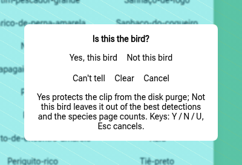</td>
</tr>
<tr>
<td align="center"><b>By Hour — every species by half hour</b><br>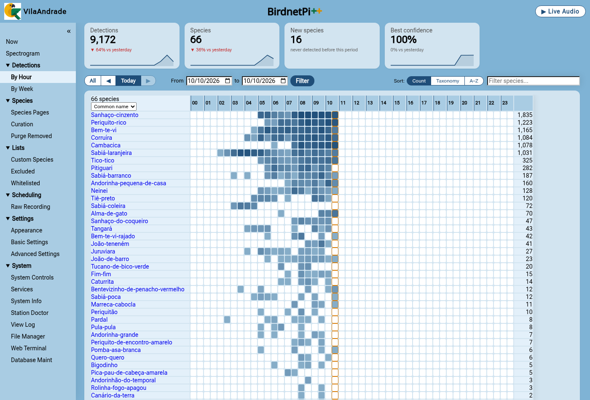</td>
<td align="center"><b>By Week — the year by calendar week</b><br>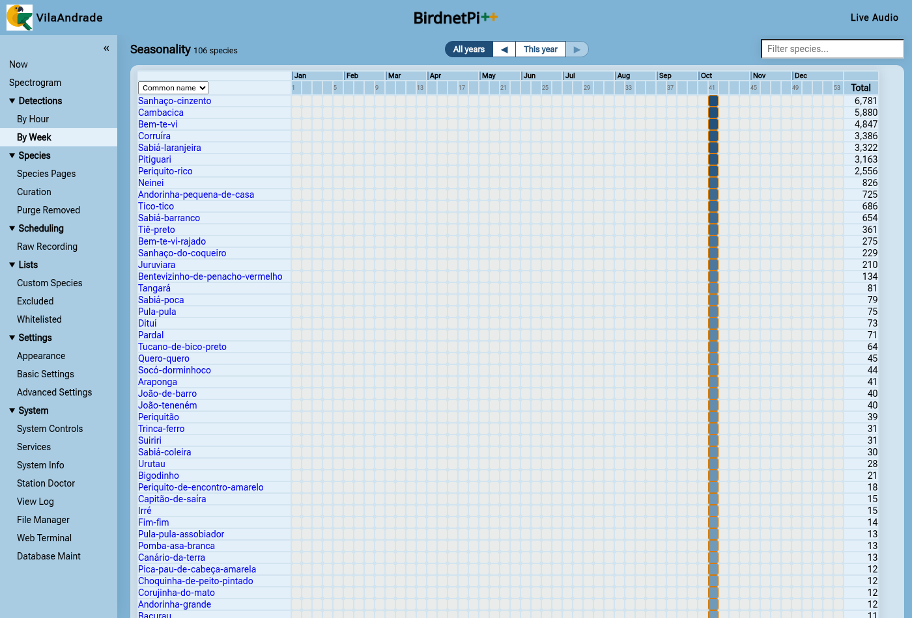</td>
</tr>
<tr>
<td align="center"><b>Species Pages — every species, its settings and lists</b><br>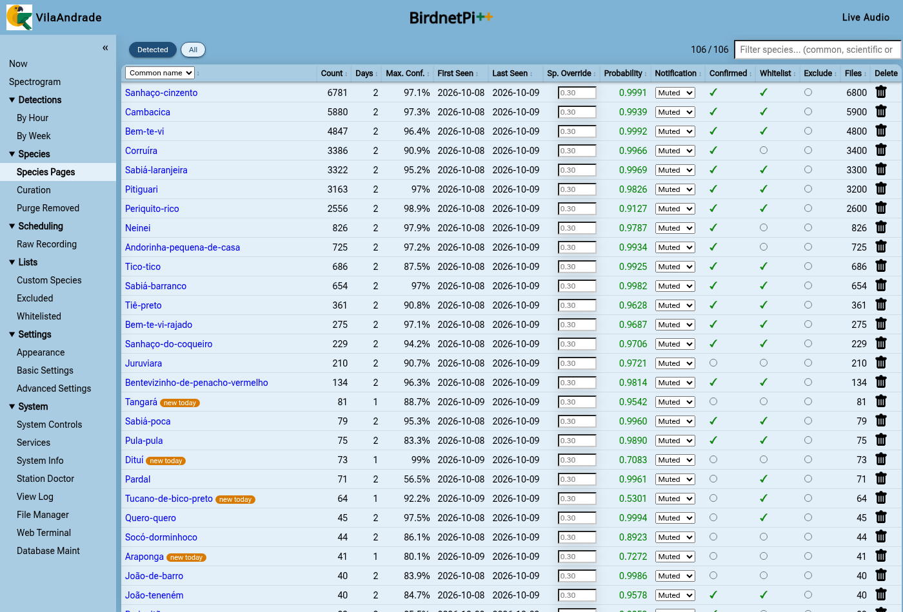</td>
<td align="center"><b>A page for every species</b><br>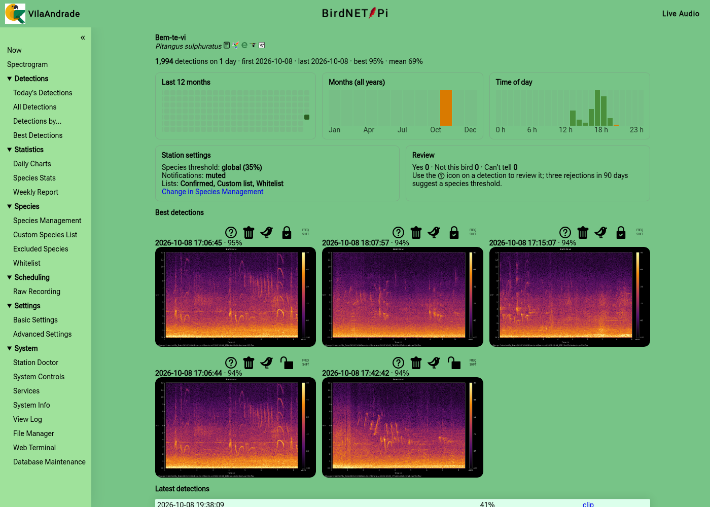</td>
</tr>
<tr>
<td align="center"><b>Lists — available species by group and region</b><br>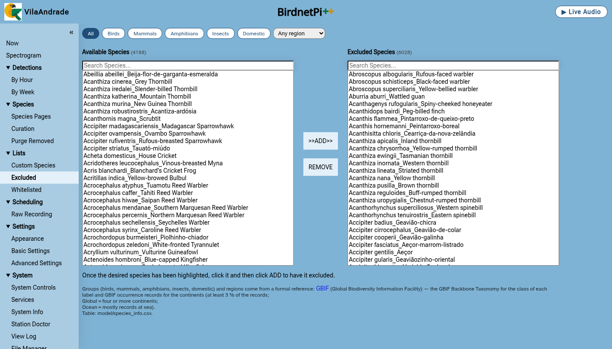</td>
<td align="center"><b>Appearance — colour themes</b><br>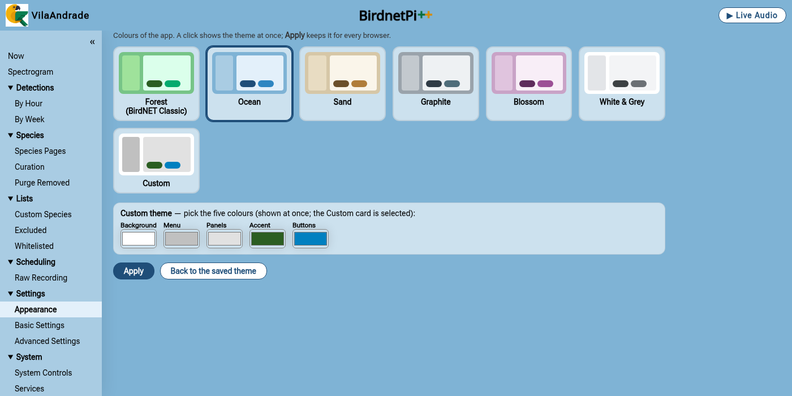</td>
</tr>
<tr>
<td align="center"><b>Station Doctor</b><br>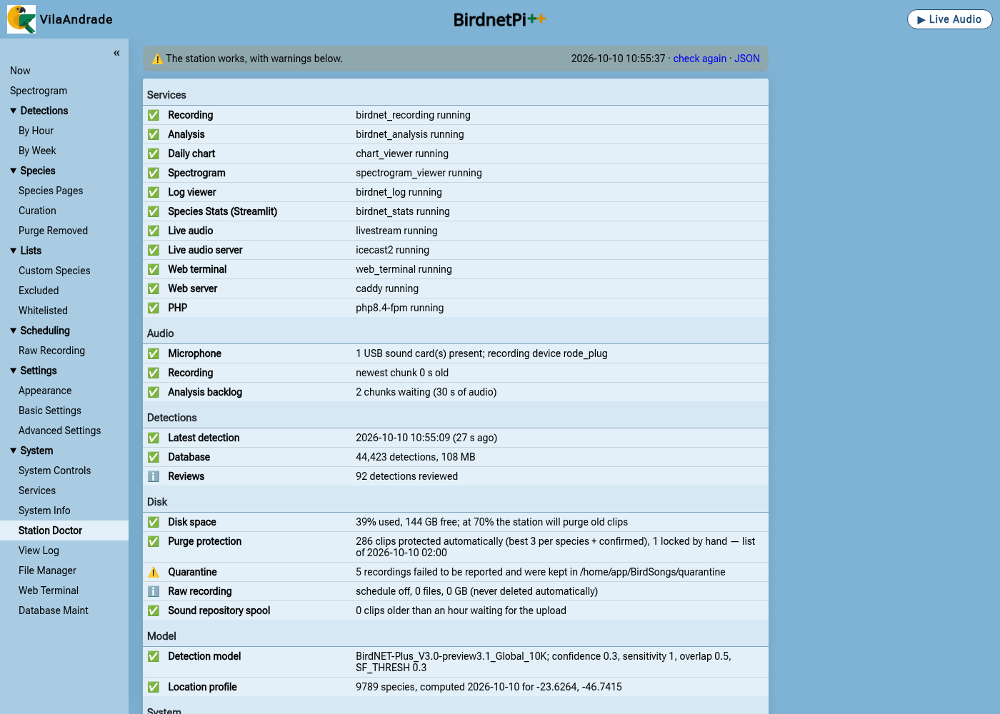</td>
<td align="center"><b>Live spectrogram — palettes and detection labels</b><br>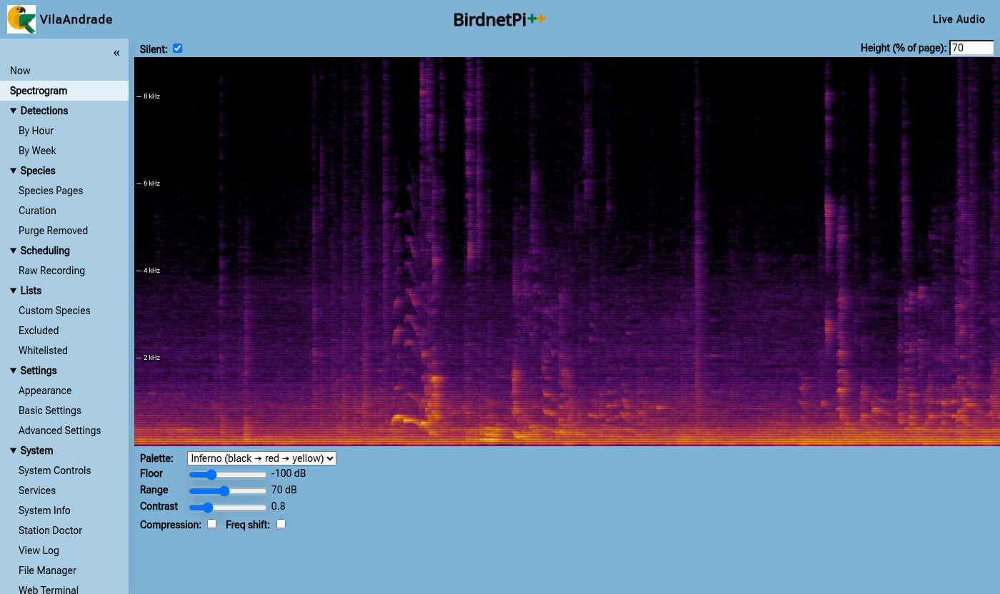</td>
</tr>
<tr>
<td align="center"><b>Settings — models, shadow model and species filter</b><br>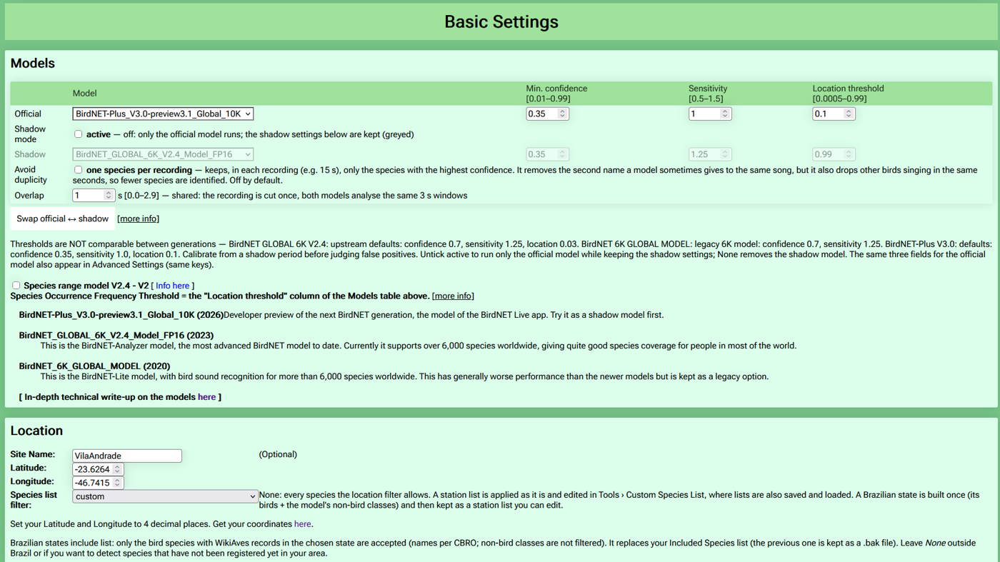</td>
<td align="center"><b>Notifications — Normal and Prio, quiet hours, region-rare alerts</b><br>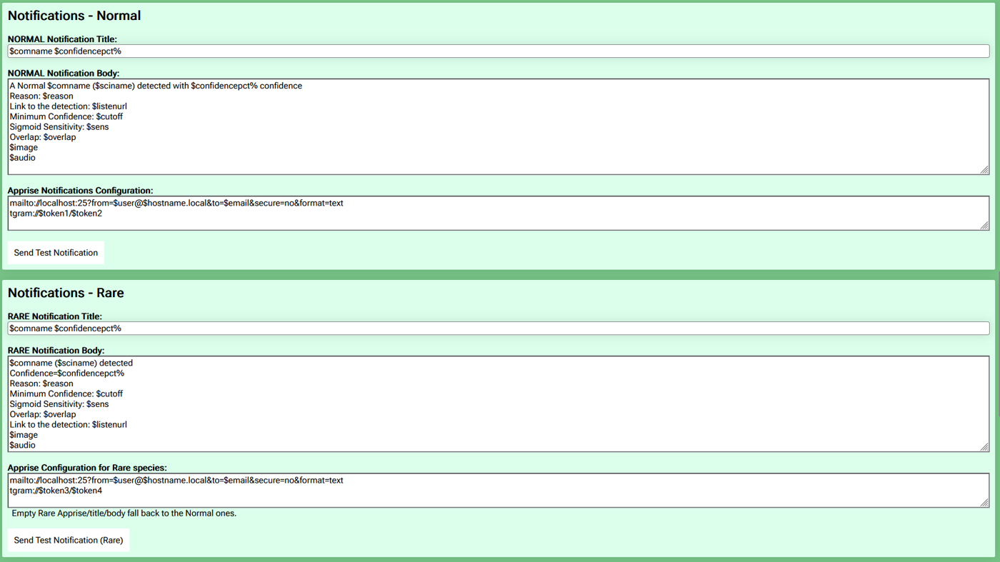</td>
</tr>
</table>

On a phone (the menu opens from the ☰ button):

<table>
<tr>
<td align="center"><b>Now</b><br>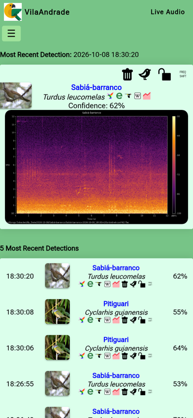</td>
<td align="center"><b>Species page</b><br>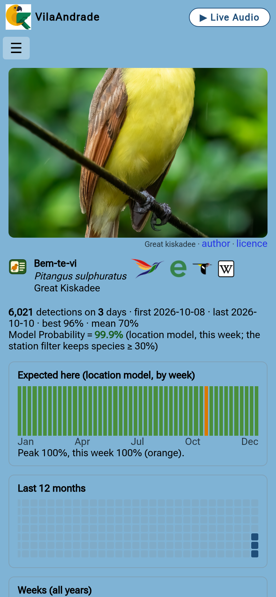</td>
</tr>
</table>

### Reporting issues

- Matters specific to **BirdnetPi++** (the stories above, the upgrade package): please open an
  [issue in this repository](https://github.com/EvaldoOliveira/BirdnetPiPlusPlus/issues/new/choose) — user story, defect or epic.
- Behaviour that also occurs on a standard installation belongs to
  [Nachtzuster's tracker](https://github.com/Nachtzuster/BirdNET-Pi/issues).
- Neither project adjudicates detections: questions about the classification performance of the BirdNET models
  should be addressed to the [BirdNET team](https://github.com/birdnet-team).

### Data sources

- **Species type and region** of the list filters: [GBIF.org](https://www.gbif.org) — the GBIF Backbone Taxonomy (class of each label) and GBIF occurrence records (share of records per continent; 'Global' = four or more continents, 'Ocean' = mostly records at sea), queried through the GBIF API on 2026-10-09 by `scripts/build_species_info.py`. Labels GBIF does not know under the model's name (recent genus changes) are looked up under the name of the other model, else typed from the BirdNET+ labels table. GBIF data is published under CC0 / CC BY licences by its data publishers.
- **Field-guide (taxonomic) order** of the species tables: the [eBird/Clements taxonomy](https://www.birds.cornell.edu/clementschecklist/) (Cornell Lab of Ornithology) — its TAXON_ORDER sequence, order and family, downloaded on 2026-10-10 by `scripts/build_taxonomy_order.py` into `model/taxonomy_order.csv`; a bird missing under the model's name takes its genus' place, non-birds follow the birds.

### Licence and credits

[CC BY-NC-SA 4.0](LICENSE), inherited from BirdNET-Pi and from the BirdNET models — **non-commercial use only**,
share alike, with attribution. This edition stands on the work of
[@mcguirepr89](https://github.com/mcguirepr89) (BirdNET-Pi), [@Nachtzuster](https://github.com/Nachtzuster) (the
maintained fork BirdnetPi++ is based on), [@kahst](https://github.com/kahst) and the
[BirdNET team](https://github.com/birdnet-team) at the K. Lisa Yang Center for Conservation Bioacoustics (Cornell Lab
of Ornithology) and Chemnitz University of Technology (the BirdNET models), and every contributor credited in the
sections below.

---

# BirdNET-Pi — standard information (from the upstream README)

The sections below come from Nachtzuster's README and apply to BirdnetPi++ unchanged, unless a note says otherwise.

## About Nachtzuster's fork
Nachtzuster built on [mcguirepr89's](https://github.com/mcguirepr89/BirdNET-Pi) work to update and improve
BirdNET-Pi. His changes, all included here:

 - Backup & Restore
 - Web ui is much more responsive
 - Daily charts now include all species, not just top/bottom 10
 - Bump apprise version, so more notification type are possible
 - Swipe events on Daily Charts (by @croisez)
 - Support for 'Species range model V2.4 - V2'
 - Bookworm and Trixie support
 - Experimental support for writing transient files to tmpfs
 - Rework analysis to consolidate analysis/server/extraction. Should make analysis more robust and slightly more efficient, especially on installations with a large number of recordings
 - Bump tflite_runtime to 2.17.1, it is faster
 - Rework daily_plot.py (chart_viewer) to run as a daemon to avoid the very expensive startup
 - Lots of fixes & cleanups

## Introduction
BirdNET-Pi is built on the [BirdNET framework](https://github.com/kahst/BirdNET-Analyzer) by [**@kahst**](https://github.com/kahst) <a href="https://creativecommons.org/licenses/by-nc-sa/4.0/"></a> using [pre-built TFLite binaries](https://github.com/PINTO0309/TensorflowLite-bin) by [**@PINTO0309**](https://github.com/PINTO0309) . It is able to recognize bird sounds from a USB microphone or sound card in realtime and share its data with the rest of the world.

Check out birds from around the world
- [BirdWeather](https://app.birdweather.com)<br>

## Features
* **24/7 recording and automatic identification** of bird songs, chirps, and peeps using BirdNET machine learning
* **Automatic extraction and cataloguing** of bird clips from full-length recordings
* **Tools to visualize your recorded bird data** and analyze trends
* **Live audio stream and spectrogram**
* **Automatic disk space management** that periodically purges old audio files
* [BirdWeather](https://app.birdweather.com) integration -- you can request a BirdWeather ID from BirdNET-Pi's "Settings" > "Basic Settings" page
* Web interface access to all data and logs provided by [Caddy](https://caddyserver.com)
* [GoTTY](https://github.com/yudai/gotty) and [GoTTY x86](https://github.com/sorenisanerd/gotty) Web Terminal
* [Tiny File Manager](https://tinyfilemanager.github.io/)
* FTP server included
* SQLite3 Database
* [Adminer](https://www.adminer.org/) database maintenance
* [phpSysInfo](https://github.com/phpsysinfo/phpsysinfo)
* [Apprise Notifications](https://github.com/caronc/apprise) supporting 90+ notification platforms
* Localization supported

## Requirements
* A Raspberry Pi 5, Raspberry 4B, Raspberry Pi 400, Raspberry Pi 3B+, or Raspberry Pi 0W2 (The 3B+ and 0W2 must run on RaspiOS-ARM64-**Lite**)
* An SD Card with the **_64-bit version of RaspiOS_** installed (please use Trixie) -- Lite is recommended, but the installation works on RaspiOS-ARM64-Full as well. Downloads available within the [Raspberry Pi Imager](https://www.raspberrypi.com/software/).
* A USB Microphone or Sound Card

## Installation
[A comprehensive installation guide is available here](https://github.com/mcguirepr89/BirdNET-Pi/wiki/Installation-Guide). This guide is slightly out-dated: make sure to pick Bookworm, also the curl command is still pointing to mcguirepr89's repo.

Please note that installing BirdNET-Pi on top of other servers is not supported. If this is something that you require, please open a discussion for your idea and inquire about how to contribute to development.

[Raspberry Pi 3B[+] and 0W2 installation guide available here](https://github.com/mcguirepr89/BirdNET-Pi/wiki/RPi0W2-Installation-Guide)

To install BirdnetPi++, follow [How to get BirdnetPi++](#how-to-get-birdnetpi). The installer takes care of
any and all necessary updates, so you can run it as the very first command upon the first boot.

The installation creates a log in `$HOME/installation-$(date "+%F").txt`.

## Access
BirdnetPi++ can be accessed from any web browser on the same network:
- http://birdnetpi.local OR your Pi's IP address
- Default Basic Authentication Username: birdnet
- Password is empty by default — the settings pages then open without a login box. Set one in "Settings" > "Advanced Settings" (or the Station Setup) to protect them; the login dialog names the user (birdnet)

Please take a look at the [wiki](https://github.com/mcguirepr89/BirdNET-Pi/wiki) and [discussions](https://github.com/mcguirepr89/BirdNET-Pi/discussions) for information on
- [BirdNET-Pi's Deep Convolutional Neural Network(s)](https://github.com/mcguirepr89/BirdNET-Pi/wiki/BirdNET-Pi:-some-theory-on-classification-&-some-practical-hints)
- [making your installation public](https://github.com/mcguirepr89/BirdNET-Pi/wiki/Sharing-Your-BirdNET-Pi)
- [backing up and restoring your database](https://github.com/mcguirepr89/BirdNET-Pi/wiki/Backup-and-Restore-the-Database)
- [adjusting your sound card settings](https://github.com/mcguirepr89/BirdNET-Pi/wiki/Adjusting-your-sound-card)
- [suggested USB microphones](https://github.com/mcguirepr89/BirdNET-Pi/discussions/39)
- [building your own microphone](https://github.com/DD4WH/SASS/wiki/Stereo--(Mono)-recording-low-noise-low-cost-system)
- [privacy concerns and options](https://github.com/mcguirepr89/BirdNET-Pi/discussions/166)
- [beta testing](https://github.com/mcguirepr89/BirdNET-Pi/discussions/11)
- [and more!](https://github.com/mcguirepr89/BirdNET-Pi/discussions)

## Updating 

Use the web interface and go to "System" > "System Controls" > "Update". If you encounter any issues with that, or suspect that the update did not work for some reason, please save its output and post it in an issue where we can help.

> **Note for BirdnetPi++:** the web updater follows the release channel set by `UPDATE_BRANCH` in `birdnet.conf`
> (`stable` by default) on the `origin` remote of the installation; an installation switched with
> `update_birdnet.sh -r evaldo -b stable` is updated by running that same command again.

## Backup and Restore
Use the web interface and go to "System" > "System Controls" > "Backup" or "Restore". Backup/Restore is primary meant for migrating your data for one system to another. Since the time required to create or restore a backup depends on the size of the data set and the speed of the storage, this could take quite a while.

Alternatively, the backup script can be used directly. These examples assume the backup medium is mounted on `/mnt`

To backup:
```commandline
./scripts/backup_data.sh -a backup -f /mnt/birds/backup-2024-07-09.tar
```
To restore:
```commandline
./scripts/backup_data.sh -a restore -f /mnt/birds/backup-2024-07-09.tar
```

## x86_64 support
x86_64 support is mainly there for developers or otherwise more Linux savvy people.
That being said, some pointers:
- Use Debian 12 or 13
- The user needs passwordless sudo

For Proxmox, a user has reported adding this in their `cpu-models.conf`, in order for the custom TFLite build to work.
```
cpu-model: BirdNet
    flags +sse4.1
    reported-model host
```

## Uninstallation
```
/usr/local/bin/uninstall.sh && cd ~ && rm -drf BirdNET-Pi
```

## Migrating
Before switching, make sure your installation is fully up-to-date. Also make sure to have a backup, that is also the only way to get back to the original BirdNET-Pi.
Please note that upgrading your underlying OS to Bookworm is not going to work. Please stick to Bullseye. If you do want Bookworm, you need to start from a fresh install and copy back your data. (remember the backup!)

To move an existing installation to BirdnetPi++, see
[Option 2 — Upgrade an existing Nachtzuster installation](#option-2--upgrade-an-existing-nachtzuster-installation).

## Troubleshooting and Ideas
*Hint: A lot of weird problems can be solved by simply restarting the core services. Do this from the web interface "System" > "Services" > "Restart Core Services"*

For BirdnetPi++ see [Reporting issues](#reporting-issues). For a standard installation, Nachtzuster asks: submit an *issue for trouble* and a *discussion for ideas*, search the repository before creating a new one, and do not open issues about "false positives" — the repository has nothing to do with the validity of the detection results.

## Sharing
Please join a Discussion!! and please join [BirdWeather!!](https://app.birdweather.com)
I hope that if you find BirdNET-Pi has been worth your time, you will share your setup, results, customizations, etc. [HERE](https://github.com/mcguirepr89/BirdNET-Pi/discussions/69) and will consider [making your installation public](https://github.com/mcguirepr89/BirdNET-Pi/wiki/Sharing-Your-BirdNET-Pi).

## Homeassistant addon

BirdNET-Pi can also be run as a [Homeassistant](https://www.home-assistant.io/) addon through docker.
For more information : https://github.com/alexbelgium/hassio-addons/blob/master/birdnet-pi/README.md

## Docker

BirdNET-Pi can also be run as as a docker container.
For more information : https://github.com/alexbelgium/hassio-addons/blob/master/birdnet-pi/README_standalone.md

## Cool Links

- [Marie Lelouche's <i>Out of Spaces</i>](https://www.lestanneries.fr/exposition/marie-lelouche-out-of-spaces/) using BirdNET-Pi in post-sculpture VR! [Press Kit](https://github.com/mcguirepr89/BirdNET-Pi-assets/blob/main/dp_out_of_spaces_marie_lelouche_digital_05_01_22.pdf)
- [Research on noded BirdNET-Pi networks for farming](https://github.com/mcguirepr89/BirdNET-Pi-assets/blob/main/G23_Report_ModelBasedSysEngineering_FarmMarkBirdDetector_V1__Copy_.pdf)
- [PixCams Build Guide](https://pixcams.com/building-a-birdnet-pi-real-time-acoustic-bird-id-station/)
- [Core-Electronics](https://core-electronics.com.au/projects/bird-calls-raspberry-pi) Build Article
- [RaspberryPi.com Blog Post](https://www.raspberrypi.com/news/classify-birds-acoustically-with-birdnet-pi/)
- [MagPi Issue 119 Showcase Article](https://magpi.raspberrypi.com/issues/119/pdf)


### Internationalization:
The bird names are in English by default, but other localized versions are available thanks to the wonderful efforts of [@patlevin](https://github.com/patlevin) and Wikipedia. Use the web interface's "Settings" > "Basic Settings" and select your "Database Language" to have the detections in your language.

[Internationalization](docs/translations.md)


## :thinking:
Are you a lucky ducky with a spare Raspberry Pi? [Try Folding@home!](https://foldingathome.org/)
